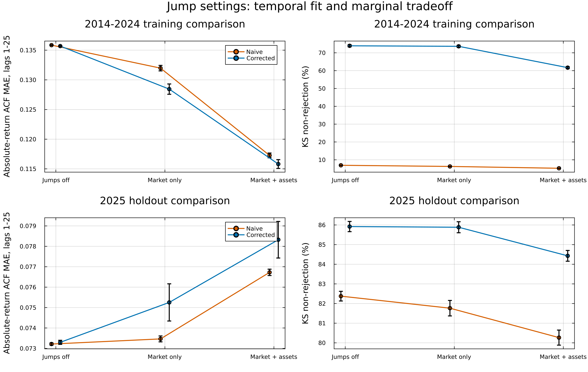

# Multi-asset jump experiment

Frozen-fit comparison of three jump settings, each evaluated with paired naive and variance-corrected composition.

## Findings for corrected composition

- **market_only:** ACF25 error fell by 5.35% in training and rose by 2.67% in 2025. KS pass rates changed from 73.94% to 73.64% in training and from 85.92% to 85.88% in 2025.
- **market_and_assets:** ACF25 error fell by 14.65% in training and rose by 6.86% in 2025. KS pass rates changed from 73.94% to 61.68% in training and from 85.92% to 84.43% in 2025.
- Mean corrected variance divided by the active generator's variance ranges from 1.00011 to 1.00045 across the six setting/window combinations.

These results distinguish compatibility of jumps with variance correction from transfer of the SPY jump calibration. The Monte Carlo intervals and historical-data limitations below govern their interpretation.

## Design

- Cases: jumps off; SPY market jumps only; jumps in SPY and every asset generator.
- Enabled models use epsilon = 0.0001, lambda = 90.0 trading days, negative-tail probability = 0.52, and 5 states per tail. These published SPY settings are transferred to the cached closing-price models, without per-ticker tuning.
- All state partitions, transitions, emissions, SIM calibrations, and branch settings are frozen at the existing 2014-2024 fits. All 424 cached fits were checked to have jumps disabled before copying them.
- 250 paths per seed, seeds 1234, 2345, 3456, 4567. Each ticker receives 1000 paths per setting and method.
- Training comparison: 2,766 days; holdout: 249 days in 2025. All eligible non-market assets are included in each window.
- SPY is simulated in both windows. This differs from the existing manuscript's in-sample table, which conditions on observed SPY. All three new settings use the same market-generation protocol.
- One market path is shared across all assets in each replication. Naive and corrected methods receive exactly the same asset and market draws. The off and market-only cases reuse the no-jump asset draws; the market-only and market-plus-assets cases reuse the jump-enabled market draws.
- Enabled and disabled models use separate RNG namespaces. Across jump settings, matching replication IDs do not imply identical innovations. Within each setting, the naive/corrected comparison is exactly paired.
- The primary temporal metric is mean absolute error in the absolute-return ACF over lags 1-25; lags 1-60 are a secondary check. These are intentionally the same in both windows and differ from the manuscript's single-asset 252-lag score.
- The main results include every simulated path. Jump-active strata are mechanism diagnostics, not replacements for unconditional results.
- No copula reorder or joint residual dependence model is used.

## Main results

All entries below are equal-weight cross-ticker averages of per-path metrics. Variance ratios in this table are **means**, not the manuscript's cross-ticker medians. W1/SD divides each ticker's Wasserstein distance by its observed standard deviation.

| Window | Jump setting | Composition | KS % | AD % | ACF MAE 25 | ACF MAE 60 | W1/SD | Variance / generator | Variance / observed | 99% exceedance % |
|---|---|---|---:|---:|---:|---:|---:|---:|---:|---:|
| training | off | naive | 6.93 | 3.38 | 0.13585 | 0.09492 | 0.1476 | 1.3327 | 1.3998 | 0.590 |
| training | off | hybrid | 73.94 | 68.54 | 0.13569 | 0.09485 | 0.0571 | 1.0001 | 1.0549 | 0.802 |
| training | market_only | naive | 6.28 | 3.18 | 0.13197 | 0.09208 | 0.1532 | 1.3494 | 1.4171 | 0.582 |
| training | market_only | hybrid | 73.64 | 67.81 | 0.12844 | 0.08969 | 0.0576 | 1.0003 | 1.0551 | 0.802 |
| training | market_and_assets | naive | 5.25 | 2.56 | 0.11727 | 0.08264 | 0.1668 | 1.3345 | 1.4735 | 0.548 |
| training | market_and_assets | hybrid | 61.68 | 53.33 | 0.11581 | 0.08154 | 0.0712 | 1.0002 | 1.1114 | 0.752 |
| holdout_2025 | off | naive | 82.38 | 70.14 | 0.07322 | 0.06683 | 0.2035 | 1.3608 | 1.5025 | 1.182 |
| holdout_2025 | off | hybrid | 85.92 | 78.76 | 0.07330 | 0.06687 | 0.1689 | 1.0004 | 1.1556 | 1.601 |
| holdout_2025 | market_only | naive | 81.76 | 69.60 | 0.07347 | 0.06698 | 0.2055 | 1.3664 | 1.5078 | 1.190 |
| holdout_2025 | market_only | hybrid | 85.88 | 78.72 | 0.07525 | 0.06796 | 0.1693 | 1.0005 | 1.1556 | 1.618 |
| holdout_2025 | market_and_assets | naive | 80.27 | 68.19 | 0.07672 | 0.06885 | 0.2156 | 1.3603 | 1.5816 | 1.170 |
| holdout_2025 | market_and_assets | hybrid | 84.43 | 77.21 | 0.07832 | 0.06973 | 0.1785 | 1.0004 | 1.2292 | 1.589 |



## Changes from jumps off, corrected composition

Negative ACF differences indicate improved temporal fit. KS differences are percentage points. Intervals are approximate 95% **Monte Carlo** intervals conditional on these fitted models and observed histories. Replications, with all tickers kept together under their shared market path, are the uncertainty units; assets are not counted as independent market histories. These intervals do not quantify uncertainty across historical regimes, calibration samples, or future years.

| Window | Change | Metric | Difference | MC interval |
|---|---|---|---:|---:|
| training | market_only/hybrid | ks_pass | -0.29669 | [-1.08186, 0.48848] |
| training | market_only/hybrid | abs_acf_mae25 | -0.00725 | [-0.00812, -0.00638] |
| training | market_only/hybrid | abs_acf_mae60 | -0.00517 | [-0.00578, -0.00456] |
| training | market_and_assets/hybrid | ks_pass | -12.25366 | [-13.01577, -11.49156] |
| training | market_and_assets/hybrid | abs_acf_mae25 | -0.01988 | [-0.02063, -0.01913] |
| training | market_and_assets/hybrid | abs_acf_mae60 | -0.01332 | [-0.01383, -0.01280] |
| holdout_2025 | market_only/hybrid | ks_pass | -0.03534 | [-0.41117, 0.34050] |
| holdout_2025 | market_only/hybrid | abs_acf_mae25 | 0.00195 | [0.00104, 0.00287] |
| holdout_2025 | market_only/hybrid | abs_acf_mae60 | 0.00109 | [0.00056, 0.00162] |
| holdout_2025 | market_and_assets/hybrid | ks_pass | -1.49087 | [-1.86537, -1.11636] |
| holdout_2025 | market_and_assets/hybrid | abs_acf_mae25 | 0.00502 | [0.00412, 0.00593] |
| holdout_2025 | market_and_assets/hybrid | abs_acf_mae60 | 0.00286 | [0.00233, 0.00338] |

The incremental effect of enabling asset jumps while retaining exactly the same jump-enabled market paths is reported separately:

| Window | Composition | Metric | Difference | MC interval |
|---|---|---|---:|---:|
| training | corrected | ks_pass | -11.95697 | [-12.13370, -11.78025] |
| training | corrected | abs_acf_mae25 | -0.01262 | [-0.01278, -0.01247] |
| training | corrected | abs_acf_mae60 | -0.00815 | [-0.00827, -0.00803] |
| holdout_2025 | corrected | ks_pass | -1.45553 | [-1.58095, -1.33011] |
| holdout_2025 | corrected | abs_acf_mae25 | 0.00307 | [0.00298, 0.00316] |
| holdout_2025 | corrected | abs_acf_mae60 | 0.00176 | [0.00171, 0.00182] |

## Breadth across assets

Fraction of tickers whose average metric improved versus jumps off. These are descriptive fractions, without per-ticker significance claims.

| Window | Jump setting | Composition | Assets | ACF25 improved % | ACF60 improved % | KS improved % | W1 improved % |
|---|---|---|---:|---:|---:|---:|---:|
| training | market_only | naive | 423 | 99.5 | 99.5 | 6.1 | 0.0 |
| training | market_only | hybrid | 423 | 99.5 | 99.5 | 40.7 | 23.4 |
| training | market_and_assets | naive | 423 | 96.7 | 94.8 | 3.8 | 0.0 |
| training | market_and_assets | hybrid | 423 | 96.9 | 95.0 | 0.5 | 0.0 |
| holdout_2025 | market_only | naive | 416 | 29.6 | 32.2 | 25.0 | 10.1 |
| holdout_2025 | market_only | hybrid | 416 | 2.6 | 3.8 | 44.2 | 41.1 |
| holdout_2025 | market_and_assets | naive | 416 | 1.2 | 0.7 | 9.1 | 2.9 |
| holdout_2025 | market_and_assets | hybrid | 416 | 0.5 | 0.0 | 14.2 | 5.3 |

## Episode frequency and marginal-generator check

| Window | Enabled component | Paths | Paths with episodes % | Forced steps % | ACF25 error before composition |
|---|---|---:|---:|---:|---:|
| training | Market (off) | 1000 | 0.00 | 0.000 | 0.23508 |
| training | Assets (off) | 423000 | 0.00 | 0.000 | 0.13476 |
| training | Market (on) | 1000 | 24.70 | 0.929 | 0.20874 |
| training | Assets (on) | 423000 | 24.24 | 0.881 | 0.11714 |
| holdout_2025 | Market (off) | 1000 | 0.00 | 0.000 | 0.12239 |
| holdout_2025 | Assets (off) | 416000 | 0.00 | 0.000 | 0.07346 |
| holdout_2025 | Market (on) | 1000 | 2.20 | 0.619 | 0.12296 |
| holdout_2025 | Assets (on) | 416000 | 2.46 | 0.737 | 0.07812 |

## Interpretation limits

- Shared settings test transfer from SPY, not per-asset optimality. The SPY paper used VWAP prices; this composition study retains its existing closing-price fits.
- ACF improvement and marginal fit must be assessed jointly. Adding jumps can change a generator's own variance and kurtosis; preserving that generator variance does not mean preserving the no-jump or observed variance.
- Tracker and clipping branches remain active. Tracker paths target calibrated R-squared rather than generator variance; finite paths also retain sample market-asset cross-covariance.
- KS/AD non-rejection is descriptive because the samples are temporally dependent. A high pass rate does not certify a correct distribution.
- The 2025 holdout is short, and rare market episodes have limited Monte Carlo representation. VaR rates here use pathwise unconditional quantiles, not a rolling conditional risk forecast.
- Improved per-asset temporal metrics do not establish portfolio covariance or joint tail fidelity. Independent asset episodes do not restore missing residual dependence.

## Reproduction and artifacts

Run from the repository root:

```sh
julia --project=code/downstream-evaluation --threads=8 code/downstream-evaluation/scripts/11-Jump-Ablation.jl
julia --project=code/downstream-evaluation code/downstream-evaluation/scripts/11b-Jump-Ablation-Report.jl
julia --project=code/downstream-evaluation code/downstream-evaluation/test/jump_ablation.jl
```

`settings.toml` records settings and SHA-256 fingerprints of input caches, holdout data, code, simulator, and Manifest. Completed seed/window blocks are resumable only with matching settings and fingerprints. Per-path scores are reduced to ticker, market-replication, generator, and jump-stratum summaries; trajectories and individual asset-path scores are reproducible from the seeds but are not retained. `paired-contrasts.csv` contains all differences, including correction versus naive composition. `ticker-metrics.csv` also includes branch frequencies and medians within each ticker/seed batch. Original manuscript tables and model caches are not overwritten.
